# Milestone 3:  Data Storage and Kafka connects

## Objective:
* Get familiar with Docker images and containers.
* Deploy Tabular and key-Value data storage using GKE.
* Get familiar with Key-Value data storage
* Get familiar with Kafka Connects and their configuration.

## Repository:
[https://github.com/GeorgeDaoud3/SOFE4630U-MS3](https://github.com/GeorgeDaoud3/SOFE4630U-MS3)

## Docker and Kubernetes:
1. Watch The following video to understand [Docker](https://youtu.be/rOTqprHv1YE) terminologies.
2. To manage Docker images and applications, we will use Kubernetes, watch the following  video to get familiar with [Kubernetes and its components](https://youtu.be/cC46cg5FFAM).
3. To setup Google Kubernetes Engine (GKE). Open the console within your Google Cloud Platform (GCP) project.
   1. Set the default compute zone to **northamerica-northeast1-b** 
   ```cmd
   gcloud config set compute/zone northamerica-northeast1-b  
   ```
   2. Enable GKE by searching for **Kubernetes Engine**, select **Kubernetes Engine API**, click **Enable**. 
   
      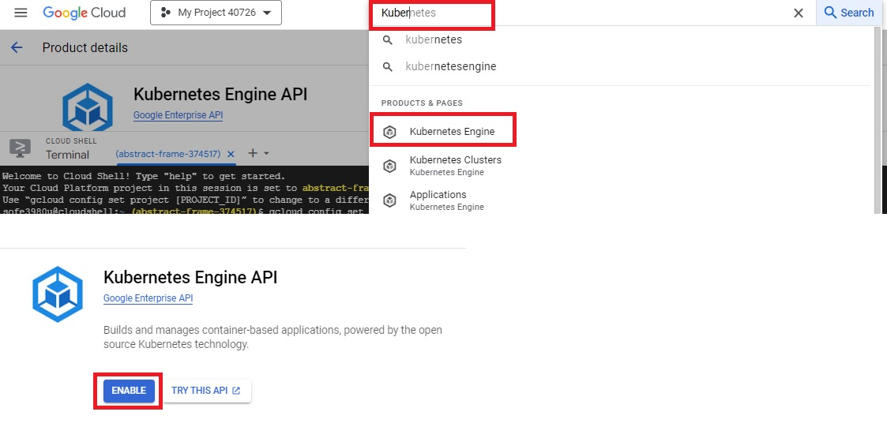
   
   3. Wait until the API is enabled then, create a three-nodes cluster on GKE called **sofe4630u**. 
   ```cmd
   gcloud container clusters create sofe4630u --num-nodes=3 
   ```
   **Note**: if the authorization windows popped up, click Authorize 
   **Note**: if you got an error that there is no available resources to create the nodes, you may need to change the default compute zone (e.g. to **us-central1-a** ) 

## Deploy MySQL using GKE:
1. To deploy a pre-existed MySQL image over the GKE cluster, we will use a YAML file. A YAML file is a file containing the configuration used to set the deployment
   1. Clone the gitGub repository
   ```cmd 
   cd ~
   git clone https://github.com/GeorgeDaoud3/SOFE4630U-MS3.git
   ```
   2. run the following command to deploy the mysql 
   ```cmd 
   cd ~/SOFE4630U-MS3/mySQL
   kubectl create -f mysql-deploy.yaml
   ```
   The command will deploy the template stored in the **mysql-deploy.yaml** into GKE. The file is shown in the following figure and can be interpreted as:
      * **Indentation** means nested elements
      *	**Hyphen** means an element within a list
      *	**First two lines**: indicate that the type of the yaml and its version.
      *	**Line 4**: provides a name for the deployment.
      *	**Line 6**: indicates that only a single pod will be used
      *	**Line 9**: provides the name of application that will be accessed by the pod.
      *	**Line 16**: provides the ID of the Docker image to be deployed
      *	**Lines 19-24**: define image-dependent environment variables that defines username/password (**usr/sofe4630u**) , and a schema (**Readings**).
      *	**Line 26**: defines the port number that will be used by image.
      
         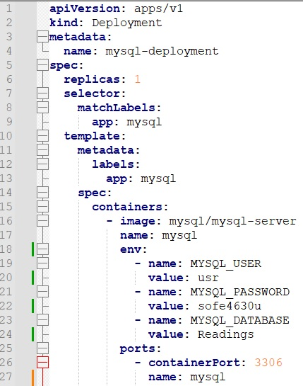      
   
   3. The status of the deployment can be checked by the following command
   ```cmd 
   kubectl get deployment 
   ```
   4. While the status of pods can be accessed by the following command 
   ```cmd 
   kubectl get pods  
   ```
   check that the deployment is available and that the pod is running successfully (it may take some time until everything is settled down)
2. To give the deployment an IP address 
   1. A load Balancer service should be created using the mysql-service.yaml file from the cloned gitHub
   ```cmd 
   cd ~/SOFE4630U-MS3/mySQL
   kubectl create -f mysql-service.yaml
   ```
   The important lines in the mysql-service.yaml file are:
      * **Line 8**: the port number that will be assigned to the external IP
      * **Line 10**:  the name of application that will be targeted by the service.
     
         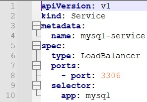      
   
   2. To check the status of the service, use this command 
   ```cmd 
   kubectl get service 
   ```
   
      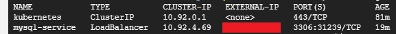      
   
      It may take some time until the external IP address is changed from pending to a valid IP address. You may need to repeat the previous command.
3. To access the MySQL using the IP address,
   1. From the GCP console ( or any other device in which MySQL client is installed), run the following commands. Before running the command, replace the **\<IP-address\>** with the external IP obtained at the previous step. The options -u, -p**, and **-h** are used to specify the **username**, **password**, and **the host IP** od the deployed server, respectively. 
   ```cmd
   mysql -uusr -psofe4630u -h<IP-address>
   ```
   2. Try to run the following SQL statements 
   ```sql
   use Readings; 
   create table meterType( ID int, type varchar(50), cost float); 
   insert into meterType values(1,'boston',100.5); 
   insert into meterType values(2,'denver',120); 
   insert into meterType values(3,'losang',155); 
   select * from meterType where cost>=110; 
   ```
   3. Exit the MySQL CLI, by running
   ```sql
   exit
   ```
   4. (**optional**) after creating a video for submission, you can delete the deployment by using the following command (**Don’t run it right now**)
   ```cmd
   kubectl delete -f mysql.yaml
   ```
   
## Deploy Redis using GKE:
1. Watch the first 7:45 minutes in the following video to get familiar with [redis commands](https://youtu.be/jgpVdJB2sKQ).  
2. Both the deployment and the service are included in the same file. To deploy the file tp GKE, run the following commads 
   ```cmd
   cd ~/SOFE4630U-MS3/Redis
   kubectl create -f redis.yaml
   ```
   Check that status of deployment, service, and pod. Note that the password is set within the yaml file to **sofe4630u**.
3.	Get Redis external IP.
   ```cmd
   kubectl get services
   ```
   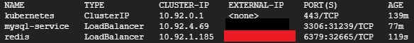      
4. To access the Redis datastorage,
   1. You can install redis client on your machine as shown in the previous video. However, let’s install it over GCP console.
   ```cmd
	sudo apt-get install redis-tools
   ```
      **Note**: this installation in not persistent and you need to repeat it each time the session is ended.
   2. Know let’s log in to server using the command after replacing the **\<Redis-IP\>** by the IP obtained in step 3. Note that **sofe4630u** is the password  
   ```cmd
   redis-cli -h <Redis-IP> -a sofe4630u
   ```
   3. No try to run the following commands. Note, there are 16 different databases to select within redis. The first command selects the first database (0)
   ``` cmd
   select 0
   set var 100
   get var
   keys *
   del var
   keys *
   ```
   4. Finally to exit Redis command line interface, type
   ```cmd
   exit
   ```
5. To access, redis with python,
   1. Install its library on your local machine (or GCP console) 
   ``` cmd
   pip install redis
   ```
   2. In the cloned Github at path **/redis/code/**, there are two python files and a jpg image. 
      * **SendImage.py**, will read the image **ontarioTech.jpg** and store it in Redis associated with a key **OntarioTech** at database 0.
      * **ReceiveImage.py**, will read the value associated with the key **OntarioTech** from the Redis server and will save it into **received.jpg** image.
      * You have to set the Redis Server Ip in the second line in both SendImage.py and ReceiveImage.py.
      * Run SendImage, then check the keys in the redis server. Finally, Run ReceiveImage and check if the received.jpg image.

## Configure Kafka Connector with MySQL sink
1. Watch the following video about [Kafka connect](https://youtu.be/YXgXw25E5RU).
2. Log in to your **Confluent Kafka account** you created in the first milestone. Make sure you are still in the trial period.
3. As described is the first milestone, create a topic and name it **Readings**. This topic will be accessed by the connector for data.
4. Add a Schema to the topic to be used by the connector to create a table in MySQL database. The three following steps will be run only once to setrp schema registry and will not be repeated for any other schemas
   1. Select **Reading** topic, choose **schema**, click **setup Schema Registry**.
   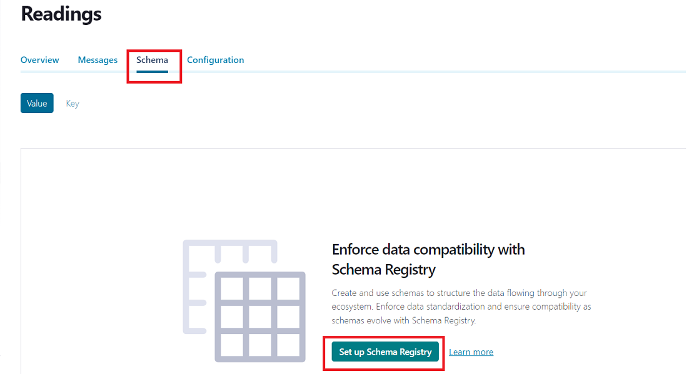      
   2. To setup the **schema Registry**, at **Stream Governance Packages**, choose **Essentials**.
   3. Then choose **Google Cloud** as Cloud provider and **us-central1** as the Region. Then, click **Enable**
   
   4. Now, the **schema Registry** is configured, go back to the topic and choose **schema** again as in step a) and choose **Set a schema**.
   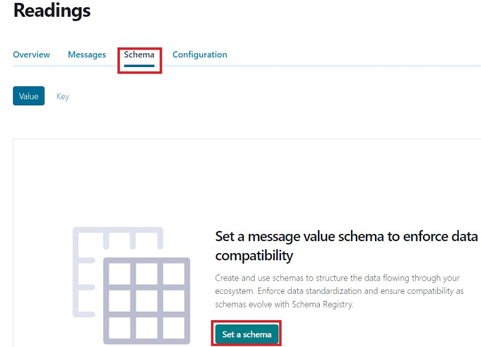
   5. Choose **Avro** as the serialization format and copy the [following script](connectors/mysql/schema.txt) as the schema, then click **create**.
5. Create a MySQL sink connector.
   1. Within the cluster, click **Add Connector**, choose **connectors**, search for **MySQL**, and finally select **MySQL sink**
   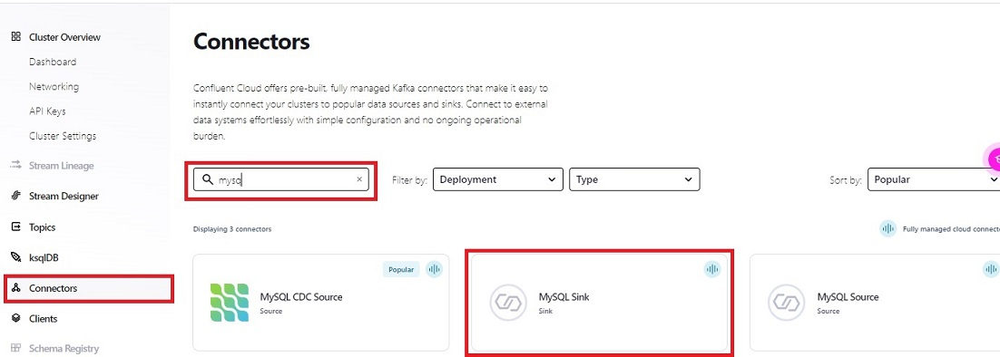
   2. Fill the configuration as in 
      1. **Topic selection**:
         * **Topic name** : **Readings**
      2. **Kafka credentials**: use the existing API key you have created in the first Milestone
      3. **Authentication**: Enter the information of the MySQL server we already have deployed on GKE
         * **Connection host**: The MySQL IP you obtained before
         * **Connection port**: **3306**
         * **Connection user**: **usr**
         * **Connection password**: **sofe4630u**
         * **Database name**: Readings
         * **SSL mode**: **prefer**
      4. **Configuration**: (click show advance configurations)
         * **Input Kafka record value format**: **AVRO**
         * **Insert mode**: **UPSERT**
         * **Auto create table**: **true**
         * **Auto add columns**: **true**
         * **PK mode**: **record_value**
         * **PK fields**: **ID**
         * **Input Kafka record key format**: **string**
      5. **Sizing**: 
         * **Tasks**:1
      6. Review and launch: 
         * **Connector name**: **smartMeter2MySQL**
   
            The previous settings configured the connector to continuously consume from **Readings** topic and deserlialize the message using Avro schema into a record. The record will be stored in the MySQL server deployed before on GKE. A table with the same name as the topic (**Readings**) will be created in the database and the data will be inserted using the field named **ID** as the primary key.
   3. It will take few minutes until the connector is running.
6. Send data to the topic from your local machine (or GCP console)
   1. Install Avro library.
   ```cmd
   pip install avro
   ```
   2. Copy the schema ID
	
      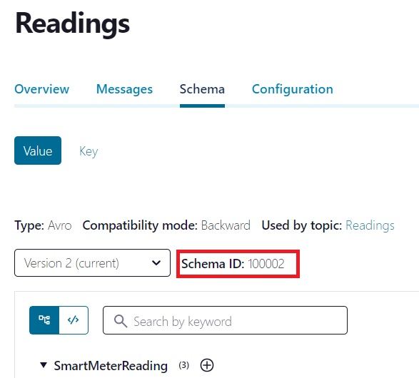
	
   3. Three files are needed found at the path /connectors/mysql/ in the GitHub repository
      * **cred.json**: you have to edit it and specify the **Bootstrap server**, the **API key**, and the **API secret** of the Kafka cluster as you did in the first milestone.
      * **schema.txt**: has the schema of the topic and will be accessed by the Avro library to serialize each record before sending it to the topic. Don't change its content.
      * **smartMeter.py**: will use **cred.json** to access the Kafka cluster and **schema.txt** to serialize records and send them as messages to be sent to the Reading topics.
      * You have to update the **schemaID** at line 12. 
      * A new function called **encode** is defined that will encode each record in Avro format.
      * Each record has a new field called **ID** that will be used as a primary key by the connector.
         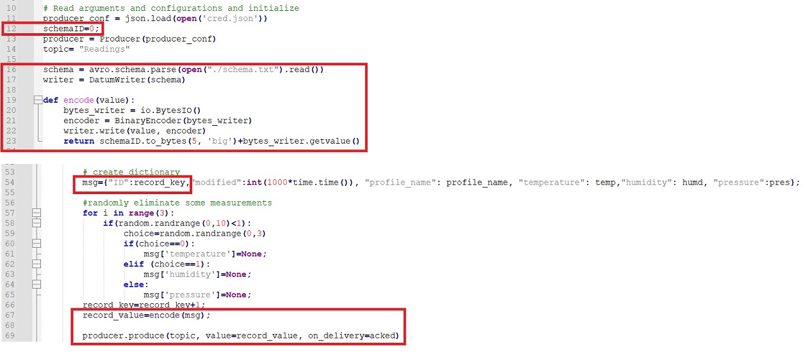
   4. Update **cred.json** and **smartMeter.py** as was described. Note the three files should be saved in the same folder.
   5. run smartMeter.py
7. check that the connector is successfully processed the messages. 
	
   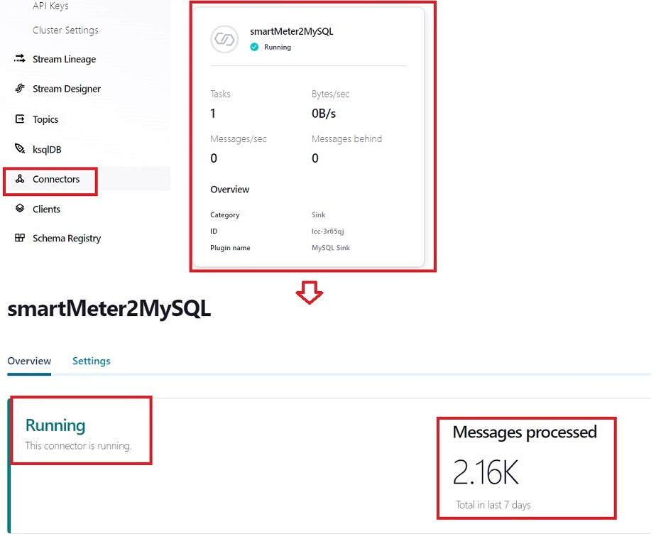
	
8. check MYSQL database
   1. log into Mysql server
   ```cmd
   mysql -uusr -psofe4630u -h<IP-address>
   ```
   2. get the list of tables in the database
   ```sql
   select TABLE_NAME from INFORMATION_SCHEMA.TABLES where TABLE_SCHEMA='Readings';
   ```
      as the connector will create a table with the same name as the topic, a table with the name **Readings** should be returned by the previous statement as well as **meterType** table created before.
   3. query the values in the table
   ```sql
   Use Readings;
   select * from Readings limit 10;
   ```
      The output should look like
	
      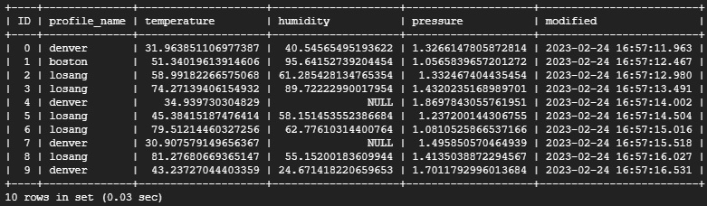
	
   4. Exit from the MySQL interface
   ```sql
   exit
   ```

## Configure Kafka Connector with MySQL source
In this section, a database will be imported from MySQL server and its recods will be sent to Kafka Topics.
1. Log in to your **Confluent Kafka account** you created in the first milestone. Make sure you are still in the trial period.
2. Create a MySQL source connector.
   1. Within the cluster, choose **connectors**, click **Add Connector**, search for **MySQL**, and finally select **MySQL source**
   2. Fill the configuration as in 
      1. **Topic selection**:
         * **Topic prefix** : **SM_**
      2. **Kafka credentials**: use the existing API key you have created in the first Milestone
      3. **Authentication**: Enter the information of the MySQL server we already have deployed on GKE
         * **Connection host**: The MySQL IP you obtained before
         * **Connection port**: **3306**
         * **Connection user**: **usr**
         * **Connection password**: **sofe4630u**
         * **Database name**: **Readings**
         * **SSL mode**: **prefer**
      4. **Configuration**: (click show advance configurations)
         * **Table names**: **Readings**
         * **Select output record value format**: **AVRO**
         * **Timestamp column name**: **modified**
         * **Input Kafka record key format**: **string**
      5. **Sizing**: 
         * **Tasks**:1
      6. Review and launch: 
         * **Connector name**: **MySQL2Kafka**
	
   The previous settings configured the connector to continuously query new records from a table (or set of tables) named **Readings** from a certain MySQL database, serlialize each record as a message in Avro format, and produce the message into a Kafka topic. The Kafka topic name will be the same as the table(s) name with a prefix (**SM_**). The Avro schema will be automatically created by the connector. **Note**, we are using the **Readings** table created in previous section to make things easier but it's not a must.
   3. It will take few minutes until the connector is running.
3. Check that a topic with the name SM_Readings is created and there are messages already received in the topic. 
4. To consume the messages, we will use three files; avroConsumer.py, cred.json, schema2.txt in the path **connectors/mysql/** at the GitHub repository.
   1. you should have copy the schema of the generated topic (**SM_Readings**), paste it into schema2.txt.
	
   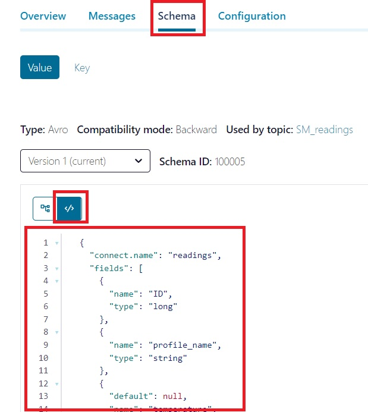
	
   2. use the same cred.json, you have updated in the previous section.
   3. Make sure that the three files are at the same folder. Then, run avroConsumer.py
	
   Noth that avroConsumer.py has a function called decode that deserialize Avro objects. 
	
## Redis Sink Connector
The key and value of Kafka message will be uses as key and value for Redis. 
1. Log in to your **Confluent Kafka account** you created in the first milestone. Make sure you are still in the trial period.
2. Create a topic and name it **ToRedis**
3. Create a Redis sink connector.
   1. Within the cluster, choose **connectors**, click **Add Connector**, search for **MySQL**, and finally select **Redis Sink**
   2. Click Next
   3. Fill the configuration as in 
      1. **Install Connector**:
         * **Select or create new topics** : **ToRedis**
      2. **Kafka credentials**: use the existing API key you have created in the first Milestone
      3. **Authentication**: Enter the information of the MySQL server we already have deployed on GKE
         * **Redis hostname**: The Redis IP you obtained before
         * **Redis port number**: **6379**
         * **Redis database index**: **1**
         * **Redis server password**: **sofe4630u**
         * **SSL mode**: **disabled**
      4. **Configuration**: (click show advance configurations)
         * **Input Kafka record value format**: **Readings**
         * **Select output record value format**: **AVRO**
         * **Timestamp column name**: **BYTES**
         * **Input Kafka record key format**: **String**
      5. **Sizing**: 
         * **Tasks**:1
      6. Review and launch: 
         * **Connector name**: **Kafka2Redis**
   The previous settings configured the connector to continuously consume messages from the topic named **ToRedis**. Each the key and value of each message will be stored as a key value pairs in the Redis at database 1.
4. To send an image (as an example) to the kafka topic, we will use files from the GitHub repository at the path /connectors/Redis/
   * cred.json: has to be updated as described before
   * ontarioTech.jpg: the image to be send to the kafka topic
   * produceImage.py: produce the image to kafka topic named **ToRedis** with a key **fromKafka**
   * make sure that the three files at the same folder. then, run produceImage.py.
5. To check that the connector works and that the key/value message is parsed and send to Redis server, check the status of the connector at Confluent Kafka.
6. To check that the connector, ReceiveImage.py will read the bytes associated with the key from the Redis server and save as another JPG file (**recieved.jpg**).
   * First change the IP at line 4 with the Redis IP.
   * Run ReceiveImage.py
   * check that recieved.jpg is created and its content is a copy of the original sent image.

## Discussion: 
* How do Kafka connectors maintain availability?
* MySQL connector supports three serialize/deserialize methods; JSON, AVRO, and PROTOBUF. What are the advantages and disadvantages of each.
* There are two options for **Insert mode** (**UPSERT** or **INSERT**) can be configured for MYSQL sink connector. Compare both of them and provide a test case for each of them.
* Confluent Cloud Kafka supports connectors while Google Pub/Sub doesn't support them. What's the advantages and disadvantages of adding connectors to any pub/sub service?

## Design: 
Although Google Pub/Sub doesn't support connectors, it can be implemented using Data flow or any other processing service. Update the Dataflow pipeline you implemented in the second milestone to include a paralle branch that saves the preprocessed records into a MySQL server deployed on GKE.

Write to PubSub: send the measurement back to another topic

# Deliverables
1. A report that includes the Discussion part and the .
2. The code you implemented in the Design part.
2. An audible video of about 5 minutes showing the connectors described. Your video should highlight the check steps.
3. Another audible video of about 3 minutes showing the output of the design part.
